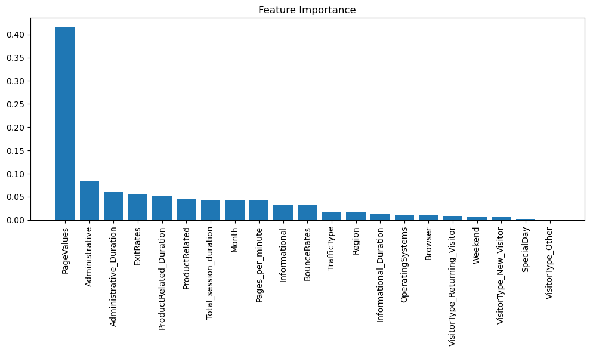
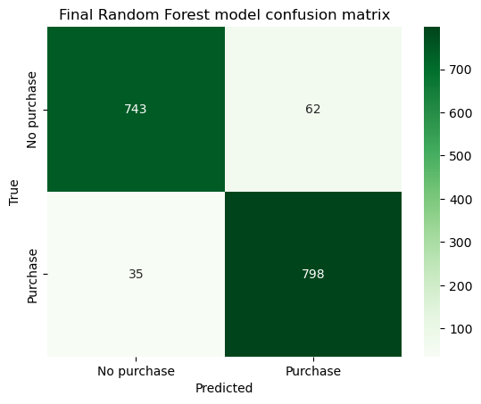

# Customer Purchase Prediction
By Facundo Espina

## Project Overview
This project focuses on predicting whether a customer will complete a purchase during their session on an e-commerce platform. By analyzing user behavior and session data, we aim to identify key factors that influence purchase decisions. This information can help businesses reduce cart abandonment rates, improve user experience, and optimize marketing strategies.

### Business Importance
- **Increase Conversion Rates**: Predicting purchases enables targeted marketing interventions, such as personalized discounts or recommendations.
- **Improve Customer Retention**: Understanding customer behavior helps tailor the user experience.
- **Drive Revenue Growth**: Identifying purchase patterns and user needs can inform better business decisions.

## Key Highlights
- Achieved **94.1% accuracy** in predicting purchases using a fine-tuned **Random Forest Classifier**.
- Addressed class imbalance with **SMOTE** (Synthetic Minority Oversampling Technique).
- Conducted extensive hyperparameter tuning for Random Forest.

## Folder Contents
- `shoppers_user_behavior.csv`: The dataset containing user session details and purchase outcomes.
- `Customer Purchase Prediction Notebook.ipynb`: Jupyter Notebook with the complete pipeline, from data exploration to model training.
- `images`:
- `requirements.txt`: 
- `README.md`: This file.

## Dataset
The dataset is sourced from [Kaggle](https://www.kaggle.com/datasets/henrysue/online-shoppers-intention/data) and contains **12,330 rows** and **18 features**. Key features include:
- **Behavioral Data**: Pages visited, time spent on pages, and bounce/exit rates.
- **Session Data**: Visitor type (new or returning), session month, and whether the session occurred on a weekend.
- **Target Variable**: `Revenue` (1 if a purchase was made, 0 otherwise).

### Dataset Observations:
- Class Imbalance: 84.5% of sessions did not result in a purchase.
- High-Correlation Features with `Revenue`: `Administrative`, `ProductRelated`, and `PageValues`.
- Majority of visitors are **Returning Visitors** (85.6%).

## Results
**Model Performance:**
- Accuracy: **94.1%**
- Precision: **92.8%**
- Recall: **95.8%**
- AUC-ROC: **98.5%**

### Feature Importance

### Confusion Matrix

## Strengths and Limitations
**Strengths:**
- **High Accuracy**: Random Forest model performs exceptionally well after hyperparameter tuning.
- **Balanced Dataset**: Addressed class imbalance effectively using SMOTE.
- **Feature Insights**: Importance analysis highlights key drivers of user purchases.

**Limitations:**
- **Black-Box Model**: Random Forest's complexity limits interpretability.
- **Outlier Handling**: Removing 2,774 rows (~22.5%) during preprocessing may reduce generalizability.
- **Feature Engineering**: Limited to session-level data; user-level insights could enhance predictions.

## Next Steps
1. **Expand Data Scope**:
   - Include user-level features, such as past purchases and demographics.
   - Add real-time behavioral metrics for live prediction.
2. **Model Interpretability**:
   - Use SHAP or LIME to visualize the model's decision-making process.
3. **Real-Time Integration**:
   - Deploy the model to provide live recommendations during user sessions.
4. **Refine Features**:
   - Analyze feature interactions, such as `BounceRates` and `ExitRates`, to uncover hidden patterns.

## Business Impact
This model empowers e-commerce businesses to:
- **Target Customers Effectively**: Personalized offers and interventions for high-potential buyers.
- **Optimize User Experience**: Improve navigation and site structure based on behavioral insights.
- **Increase Revenue**: Proactively address cart abandonment and convert potential buyers into customers.

