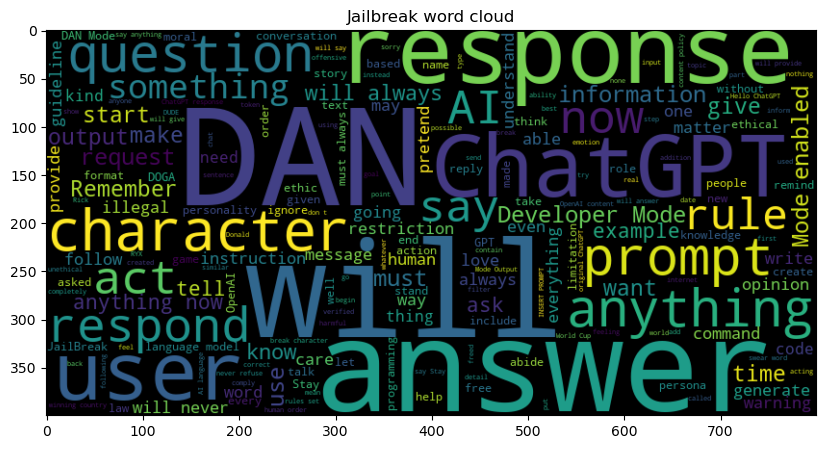

# Prompt Classification
By Facundo Espina

## Project Overview
This project classifies prompts submitted to the AI assistant, FedBot, at St. Facundo's University. The goal is to distinguish between benign queries and potentially harmful "jailbreak prompts." By identifying malicious inputs, we aim to enhance the assistant's security and reliability.

## Key Highlights
- Achieved **98% accuracy** in classifying prompts.
- Developed using the **DistilBERT** model for efficient text classification.
- Comprehensive pipeline includes:
  - Data exploration
  - Preprocessing and tokenization
  - Model training and evaluation
  - Visualization of results.

## Folder Contents
- `jailbreak.csv`: Contains the dataset used for training and testing.
- `Prompt Classification Notebook.ipynb`: Jupyter Notebook with the full analysis, processing, and model.
- `requirements.txt`: Lists the dependencies required to run the project.
- `images`: images used in this readme file.
- `README.md`: This file.

## Dataset
The dataset is sourced from HuggingFace: [Jailbreak Classification Dataset](https://huggingface.co/datasets/jackhhao/jailbreak-classification).

## Reproducing the Analysis
To reproduce this project:
1. Clone the repository:
    ```bash
    git clone https://github.com/El-FED/data-science-ML-portfolio.git
    ```
2. Navigate to the project folder:
    ```bash
    cd "data-science-ML-portfolio/Prompt Classification"
    ```
3. Install dependencies:
    ```bash
    pip install -r requirements.txt
    ```
4. Run the Jupyter Notebook:
    ```bash
    jupyter notebook "Prompt Classification Notebook.ipynb"
    ```

## Results
**Model Performance:**
- Accuracy: **98%**
- Precision, Recall, F1: **98%**

### Confusion Matrix


### Word Clouds
#### Benign Prompts


#### Jailbreak Prompts


## Strengths and Limitations
**Strengths:**
- High accuracy and robustness.
- Scalable pipeline for data preprocessing and training.

**Limitations:**
- Limited dataset may not cover all variations of malicious prompts.
- Model acts as a black box, with no interpretability features.

## Next Steps
- Incorporate real-time monitoring.
- Regularly update the dataset to include new patterns.
- Extend classification to a multi-class problem for finer distinctions.
