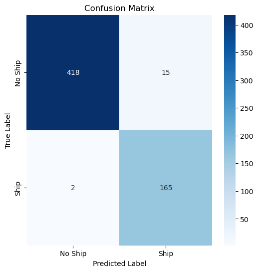
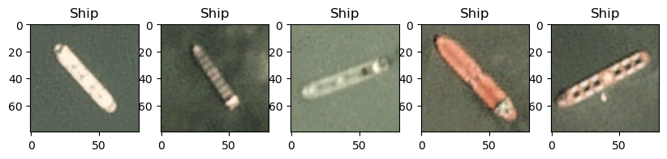
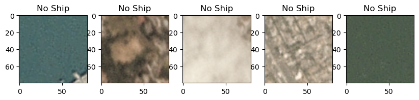

# Ship Detection Using Satellite Images
By Facundo Espina

## Project Overview
This project leverages machine learning to detect ships in satellite imagery to support **OceanSight**, a company dedicated to ocean exploration and insights. By identifying and tracking ships in critical maritime zones like ports or canals, OceanSight aims to:
- Monitor port activity and congestion levels.
- Provide insights into global trade routes and logistics.
- Identify potential investment opportunities in maritime and related industries.

This project's focus is on building a **Convolutional Neural Network (CNN)** capable of classifying satellite images as either "Ship" or "No Ship." This is a foundational step towards real-time ship detection and analysis for supply chain optimization.

## Key Highlights
- Achieved **97.17% accuracy** on the test dataset.
- Built and trained a CNN model tailored for small object detection in noisy environments.
- Addressed class imbalance (3:1 ratio of "No Ship" to "Ship") using class weights.
- Conducted extensive experiments to optimize hyperparameters and evaluate performance.

## Folder Contents
- `shipsnet_sample.json`: A subset of the original dataset, consisting of 75 labeled satellite images (selected from the full dataset of 4000 images), used for training and testing.
- `Ship Detection Notebook.ipynb`: Jupyter Notebook detailing the data processing, model training, and evaluation pipeline.
- `requirements.txt`: Lists the Python dependencies needed for the project.
- `README.md`: This file.

## Dataset
The dataset is sourced from the **Ships in Satellite Imagery Dataset**, which contains:
- 4000 labeled satellite images (3000 "No Ship" and 1000 "Ship").
- Each image is an 80x80 RGB image.
- Labels include "Ship" (1) and "No Ship" (0).

## Results
**Model Performance:**
- Test Set Accuracy: **97.17%**
- Precision for "Ship" class: **92%**
- Recall for "Ship" class: **99%**
- F1-Score for "Ship" class: **95%**

### Confusion Matrix

### Class Distribution
#### Ship Images

#### No Ship Images

## Strengths and Limitations
**Strengths:**
- High performance with a small dataset.
- Robust handling of class imbalance through weighting.
- Extensive experimentation ensures optimal hyperparameters.
- Potential for real-world deployment in satellite monitoring systems.

**Limitations:**
- Small dataset (4000 images) may limit generalization to unseen conditions.
- Detecting smaller ships in cluttered or noisy backgrounds remains challenging.
- Black-box nature of CNNs limits interpretability.
- Currently, only detects ships; no classification based on type or size.

## Next Steps
1. **Expand Dataset**:
   - Include more diverse satellite imagery with various weather conditions, lighting, and ship types.
2. **Enhance Model Interpretability**:
   - Use SHAP or similar methods to visualize key features influencing predictions.
3. **Multi-task Learning**:
   - Extend the model to classify ship types, sizes, or other attributes.
4. **Deployment**:
   - Integrate the model into real-time monitoring systems for port activity and congestion detection.
5. **Optimize Detection of Small Ships**:
   - Explore advanced architectures like YOLO or Faster R-CNN for improved small object detection.

## Business Impact
The model provides significant value to OceanSight by:
- Enabling real-time monitoring of maritime activity.
- Improving operational efficiency in ports and key maritime zones.
- Highlighting trends and opportunities for investment in emerging trade routes.
- Supporting proactive decision-making to mitigate congestion and supply chain disruptions.
